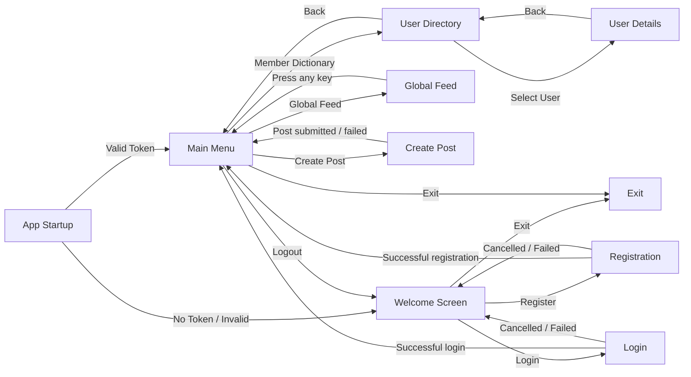

# UI Dialog Flow

## Information Items Displayed per Dialog

- **Welcome Screen**: Application header, prompt to select an action ("Register", "Login", "Exit").
- **Registration**: Form fields to collect User Name (mandatory), First Name, Last Name, Password (3-8 characters), and Biography. Displays registration success or cancellation/failure messages.
- **Login**: Form fields to collect User Name and Password. Displays login success or cancellation/failure messages.
- **Main Menu**: Application header, menu options ("Global Feed", "Create Post", "Member Dictionary", "Logout", "Exit").
- **Global Feed**: A list of posts in the system. Each post displays its Content, Post ID, and Author ID. Shows an empty feed message if no posts exist. Prompts to press any key to return.
- **User Directory**: A tabular list of all users displaying ID, Username, and Created At date. Prompts to select a specific user or return to the main menu.
- **User Details**: Detailed profile of the selected user, including Username, First Name, Last Name, Bio, and Created At timestamp. Prompts to go back.
- **Create Post**: Prompt to enter post content ("Was möchtest du teilen?"). Displays post creation success or error messages.
- **Exit**: Terminates the application.
