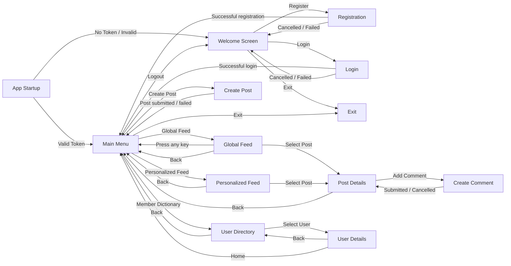

# UI Dialog Flow

## Information Items Displayed per Dialog

- **Welcome Screen**: Application header, prompt to select an action ("Register", "Login", "Exit").
- **Registration**: Form fields to collect User Name (mandatory), First Name, Last Name, Password (3-8 characters), and Biography. Displays registration success or cancellation/failure messages.
- **Login**: Form fields to collect User Name and Password. Displays login success or cancellation/failure messages.
- **Main Menu**: Application header, menu options ("Global Feed", "Personalized Feed", "Create Post", "Member Dictionary", "Logout", "Exit").
- **Global Feed**: A selectable list of all posts in the system. Each post displays its ID, Content, and counts for comments and likes. Shows an empty feed message if no posts exist. Prompts to select a post or return Home.
- **Personalized Feed**: A selectable list of posts from users the current user follows. Each post displays its ID, Content, and counts for comments and likes. Shows an empty feed message if no posts exist. Prompts to select a post or return Home.
- **User Directory**: A tabular list of all users displaying ID, Username, and Created At date. Prompts to select a specific user or return to the main menu.
- **User Details**: Detailed profile of the selected user, including Username, First Name, Last Name, Bio, and Created At timestamp. Prompts to go back.
- **User Details**: Detailed profile of the selected user, including Username, First Name, Last Name, Bio, and Created At timestamp. Provides options to **Follow/Unfollow** the user and to go back.
- **Create Post**: Prompt to enter post content ("Was möchtest du teilen?"). Displays post creation success or error messages.
- **Post Details**: Displays the full content of a single post, its author, and a list of all associated comments. Provides options to **Like/Unlike** the post, "Add Comment", or go "Back".
- **Create Comment**: Prompt to enter comment content. Displays comment creation success or cancellation messages.
- **Exit**: Terminates the application.
