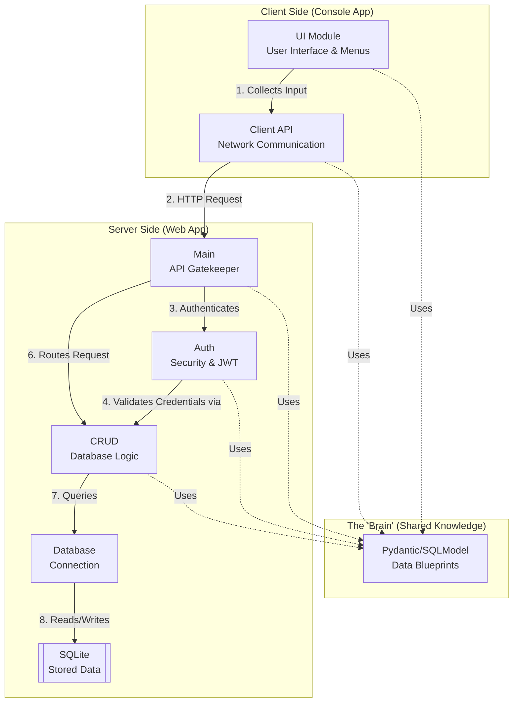
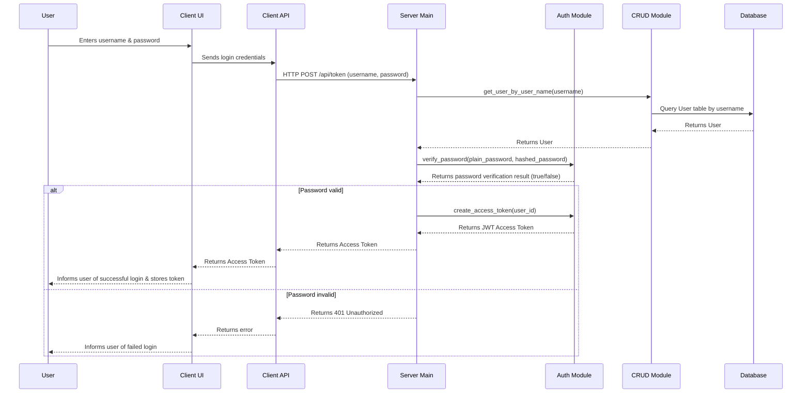
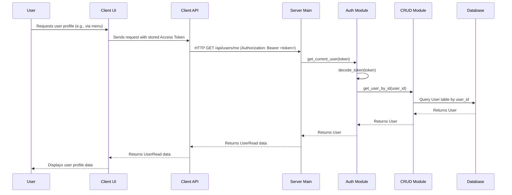

# Architecture - Social Media App

Welcome to the architectural overview! This document explains how the different parts of our application talk to each other.

---

## The Big Picture

Our application follows a **Client-Server Architecture**. Think of it like a restaurant:
*   **The Client (Console App)**: The customer who looks at the menu and places an order.
*   **The Server (Web App)**: The kitchen that receives the order, processes it (talks to the pantry/database), and sends back the food (data).

### System Overview & Control Flow

**Control Flow Description:**

1.  **Client Input**: The `UI Module` collects user input and passes it to the `Client API`.
2.  **HTTP Request**: The `Client API` sends an HTTP request to the `Main` API Gatekeeper on the server side.
3.  **Authentication**: The `Main` module directs the request to the `Auth` module for authentication.
4.  **Validation**: The `Auth` module validates the request, interacting with `CRUD` to verify user credentials or permissions.
5.  **Request Routing**: After successful authentication, `Main` routes the request to the appropriate `CRUD` operation.
6.  **Database Query**: The `CRUD` module performs queries on the `Database`.
7.  **Data Operations**: The `Database` interacts with `SQLite` to read from or write data.

**Shared Models**: The `Pydantic Models` module provides data blueprints used by `UI`, `Main`, `Auth`, and `CRUD` to ensure consistent data structures across the application.

---

## Shared Knowledge: Pydantic Models
The most important "glue" in our project is the `models.py` file. It contains **Pydantic Classes** that act as blueprints for our data.

*   **Single Source of Truth**: Both the Client and the Server import these models. This ensures they always agree on what a "User" or a "Post" looks like.
*   **Serialization/Deserialization**: When data travels over the internet, it's turned into a string (JSON). Pydantic classes are used on the client side (by `ui` and `client_api`) and server side to "package" (serialize) and "unbox" (deserialize) HTTP requests and responses, ensuring data integrity.

---

## The Web App (Backend)

### The Tech Stack
*   **FastAPI**: Our web engine. It listens for requests and automatically creates interactive documentation at `/docs`.
*   **SQLModel**: A bridge that lets us use our Pydantic models directly as database tables.
*   **SQLite**: A simple file on your disk (`database.db`) that holds all our persistent data.

### How it's Organized
1.  **Main**: The receptionist. It receives the HTTP request and decides which function should handle it.
2.  **CRUD**: The worker. It contains the logic for **C**reating, **R**eading, **U**pdating, and **D**eleting data.
3.  **Database**: The manager. It handles the low-level connection to the SQLite file.
4.  **Auth**: Handles security, such as user login and password protection. It validates JWT tokens and hashes passwords.

---

## The Console App (Frontend)

### The Tech Stack
*   **Requests**: The "telephone" the client uses to call the Server.
*   **Rich**: Makes the terminal look modern with colors, tables, and panels.
*   **Questionary**: Handles interactive forms and menus (like choosing options with arrow keys).

### How it's Organized
1.  **Client**: The starting point that kicks off the application.
2.  **UI**: The visual layer. It uses **Rich** and **Questionary** to display data and collect user input. It relies on Pydantic models to structure this data.
3.  **Client API**: The communication layer. It handles the details of making HTTP calls to the backend so the UI doesn't have to.

---

## Virtual Environment

We use a `.venv` folder to keep our project's libraries separate from your system. Both the Client and the Server share this same environment, ensuring they always use the same versions of our dependencies.

---

## Access Token Workflow

This section details how access tokens are obtained, validated, and used to authenticate requests within the system.

### 1. Token Obtainance

The following sequence diagram illustrates the process of a user logging in and obtaining an access token:

**Explanation of Token Obtainance:**

1.  **User Login**: The `User` provides their username and password through the `UI`.
2.  **Client-Side Communication**: The `UI` sends these credentials to the `Client API`, which then makes an HTTP POST request to the `/api/token` endpoint on the `Server Main` module.
3.  **User Retrieval**: The `Server Main` calls the `CRUD` module to retrieve the user details from the `Database` based on the provided username.
4.  **Password Verification**: Upon receiving the user, `Server Main` then calls the `Auth` module's `verify_password` function to check if the provided plain password matches the hashed password stored in the database.
5.  **Token Generation (Success)**: If the password is valid, `Server Main` uses the `Auth` module's `create_access_token` function to generate a JSON Web Token (JWT) containing the user's ID. This token is then returned through the `Client API` to the `UI` and stored for future authenticated requests.
6.  **Login Failure**: If the password is invalid, an unauthorized error is returned, and the `UI` informs the `User` of the failed login.

### 2. Authenticating a Request

This sequence diagram illustrates how an access token is used to authenticate a subsequent request, such as fetching user profile data from `/api/users/me`:

**Explanation of Request Authentication:**

1.  **Authenticated Request**: When the `User` initiates an action requiring authentication (e.g., viewing their profile), the `UI` sends the request along with the previously obtained Access Token to the `Client API`.
2.  **Server-Side Request**: The `Client API` includes the Access Token in the `Authorization` header of an HTTP GET request to the `/api/users/me` endpoint on the `Server Main` module.
3.  **Token Validation**: The `Server Main` module, typically through a dependency injection, calls the `Auth` module's `get_current_user` function, which internally decodes the JWT to extract the user's ID.
4.  **User Retrieval**: The `Auth` module then calls the `CRUD` module's `get_user_by_id` function to fetch the complete `User` object from the `Database`.
5.  **Request Authorization**: If the token is valid and the user exists, the `Auth` module returns the `User` object to `Server Main`.
6.  **Response**: `Server Main` then processes the request (in this case, validates the `User` object into `UserRead`) and returns the relevant `UserRead` data back through the `Client API` to the `UI`, which displays it to the `User`.
