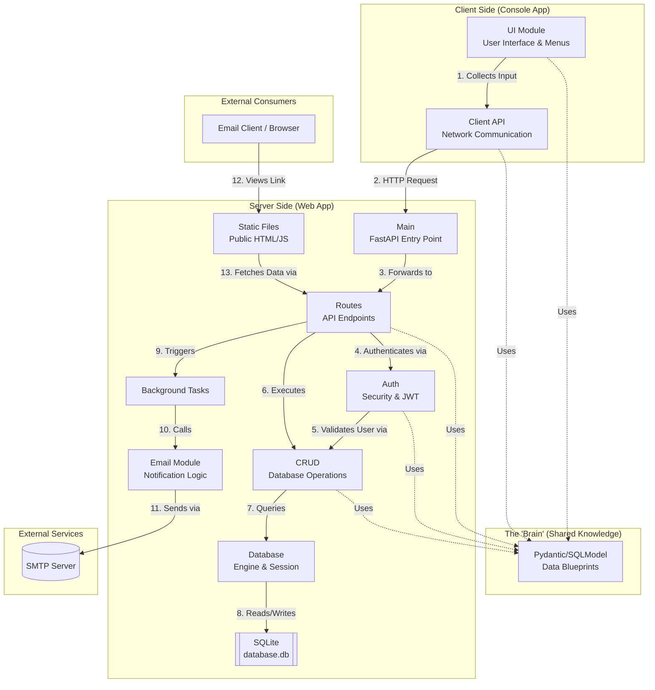
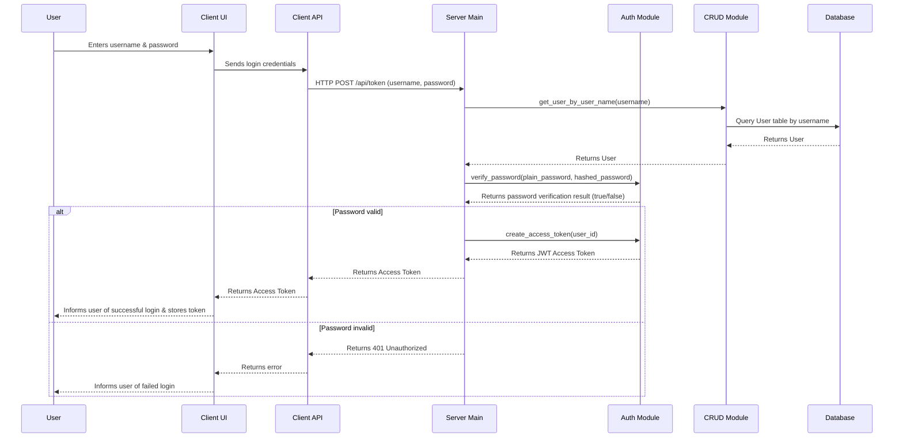
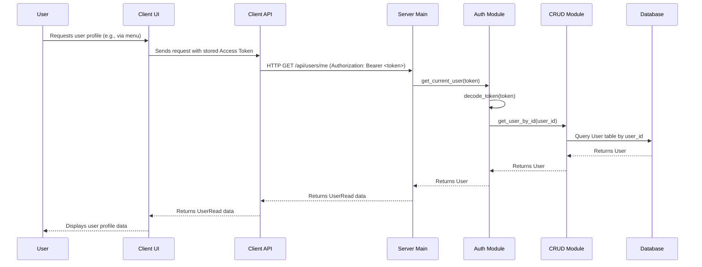
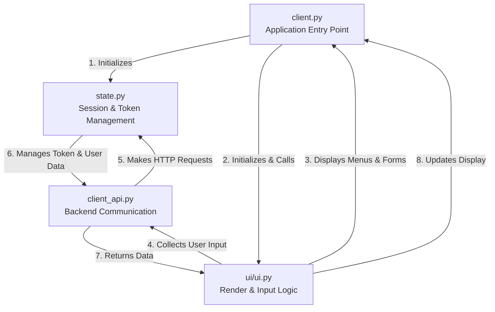
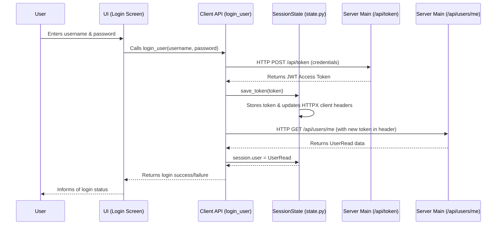

# Architecture - Social Media App

Welcome to the architectural overview! This document explains how the different parts of our application talk to each other.

---

## The Big Picture

Our application follows a **Client-Server Architecture**. Think of it like a restaurant:
*   **The Client (Console App)**: The customer who looks at the menu and places an order.
*   **The Server (Web App)**: The kitchen that receives the order, processes it (talks to the pantry/database), and sends back the food (data).

### System Overview & Control Flow

**Control Flow Description:**

1.  **Client Input**: The `UI Module` collects user input and passes it to the `Client API`.
2.  **HTTP Request**: The `Client API` sends an HTTP request to the `Main` entry point on the server side.
3.  **Request Routing**: `Main` forwards the request to the appropriate `Routes` module.
4.  **Authentication**: `Routes` uses the `Auth` module to authenticate the request (typically using FastAPI's dependency injection).
5.  **Validation**: The `Auth` module validates the JWT and interacts with `CRUD` to verify the user's existence.
6.  **CRUD Operation**: After authentication, the `Routes` module calls `CRUD` to execute the requested logic.
7.  **Database Query**: The `CRUD` module performs queries using the `Database` engine and session.
8.  **Data Operations**: The `Database` layer interacts with the `SQLite` file to read or write data.
9.  **Background Task Trigger**: For non-blocking operations like sending notifications, `Routes` adds a task to `BGTasks` (FastAPI's BackgroundTasks).
10. **Email Logic Execution**: The background task calls the `Email` module, which contains the logic for formatting and preparing the notification.
11. **Email Dispatch**: The `Email` module connects to an external `SMTP Server` to send the email to the user.
12. **Static Content Access**: The user's `Email Client` or browser follows a link from the email, which leads to a static page (e.g., an HTML file) served by the `Static Files` module.
13. **Public Data Fetching**: The static page's JavaScript makes a request to a public, token-protected API endpoint under `Routes` to securely fetch the specific content (e.g., a post) mentioned in the email.

**Shared Models**: The `Pydantic/SQLModel` module provides data blueprints used by both Client and Server to ensure consistent data structures and automated serialization/deserialization.

---

## Shared Knowledge: Pydantic Models
The most important "glue" in our project is the `models.py` file. It contains **Pydantic Classes** that act as blueprints for our data.

*   **Single Source of Truth**: Both the Client and the Server import these models. This ensures they always agree on what a "User" or a "Post" looks like.
*   **Serialization/Deserialization**: When data travels over the internet, it's turned into a string (JSON). Pydantic classes are used on the client side (by `ui` and `client_api`) and server side to "package" (serialize) and "unbox" (deserialize) HTTP requests and responses, ensuring data integrity.

---

## The Web App (Backend)

### The Tech Stack
*   **FastAPI**: Our web engine. It listens for requests and automatically creates interactive documentation at `/docs`.
*   **SQLModel**: A bridge that lets us use our Pydantic models directly as database tables.
*   **SQLite**: A simple file on your disk (`database.db`) that holds all our persistent data.

### How it's Organized
1.  **Main (web_app/main.py)**: The FastAPI application entry point. It sets up the lifespan events (like database table creation) and registers the API routers.
2.  **Routes (web_app/routes/)**: Contains endpoint definitions for different resources (e.g., `auth.py`, `users.py`, `posts.py`). These modules handle incoming HTTP requests, perform validation, call business logic (CRUD), and return responses.
3.  **Auth (web_app/auth.py)**: Handles security concerns, including user authentication, password hashing, JWT token creation, and validation. It uses FastAPI's dependency injection to secure endpoints.
4.  **CRUD (web_app/crud/)**: Contains the core business logic for **C**reating, **R**eading, **U**pdating, and **D**eleting data for specific models (e.g., `user.py`, `post.py`). It interacts directly with the database session.
5.  **Database (web_app/database.py)**: Manages the database engine and provides session dependency for FastAPI. It establishes the connection to the SQLite file.

---

## The Console App (Frontend)

### The Tech Stack
*   **Httpx**: The "telephone" the client uses to call the Server.
*   **Rich**: Makes the terminal look modern with colors, tables, and panels.
*   **Questionary**: Handles interactive forms and menus (like choosing options with arrow keys).

### How it's Organized
1.  **Client**: The starting point that kicks off the application.
2.  **UI**: The visual layer. It uses **Rich** and **Questionary** to display data and collect user input. It relies on Pydantic models to structure this data.
3.  **Client API**: The communication layer. It handles the details of making HTTP calls to the backend so the UI doesn't have to.

---

## Virtual Environment

We use a `.venv` folder to keep our project's libraries separate from your system. Both the Client and the Server share this same environment, ensuring they always use the same versions of our dependencies.

---

## Access Token Workflow

This section details how access tokens are obtained, validated, and used to authenticate requests within the system.

### 1. Token Obtainance

The following sequence diagram illustrates the process of a user logging in and obtaining an access token:

**Explanation of Token Obtainance:**

1.  **User Login**: The `User` provides their username and password through the `UI`.
2.  **Client-Side Communication**: The `UI` sends these credentials to the `Client API`, which then makes an HTTP POST request to the `/api/token` endpoint on the `Server Main` module.
3.  **User Retrieval**: The `Server Main` calls the `CRUD` module to retrieve the user details from the `Database` based on the provided username.
4.  **Password Verification**: Upon receiving the user, `Server Main` then calls the `Auth` module's `verify_password` function to check if the provided plain password matches the hashed password stored in the database.
5.  **Token Generation (Success)**: If the password is valid, `Server Main` uses the `Auth` module's `create_access_token` function to generate a JSON Web Token (JWT) containing the user's ID. This token is then returned through the `Client API` to the `UI` and stored for future authenticated requests.
6.  **Login Failure**: If the password is invalid, an unauthorized error is returned, and the `UI` informs the `User` of the failed login.

### 2. Authenticating a Request

This sequence diagram illustrates how an access token is used to authenticate a subsequent request, such as fetching user profile data from `/api/users/me`:

**Explanation of Request Authentication:**

1.  **Authenticated Request**: When the `User` initiates an action requiring authentication (e.g., viewing their profile), the `UI` sends the request along with the previously obtained Access Token to the `Client API`.
2.  **Server-Side Request**: The `Client API` includes the Access Token in the `Authorization` header of an HTTP GET request to the `/api/users/me` endpoint on the `Server Main` module.
3.  **Token Validation**: The `Server Main` module, typically through a dependency injection, calls the `Auth` module's `get_current_user` function, which internally decodes the JWT to extract the user's ID.
4.  **User Retrieval**: The `Auth` module then calls the `CRUD` module's `get_user_by_id` function to fetch the complete `User` object from the `Database`.
5.  **Request Authorization**: If the token is valid and the user exists, the `Auth` module returns the `User` object to `Server Main`.
6.  **Response**: `Server Main` then processes the request (in this case, validates the `User` object into `UserRead`) and returns the relevant `UserRead` data back through the `Client API` to the `UI`, which displays it to the `User`.

## The Client App's Internal Workings

### Client-side Module Interaction: Client, UI, and State

In the Console App, several modules collaborate to provide the user experience and interact with the backend.

**Explanation of Client-side Module Interaction:**

1.  **Application Entry Point (`client.py`)**: This is where the console application starts. It initializes the core components, including the `state` module for session management and the `ui` module for user interaction.
2.  **State Management (`state.py`)**: The `state` module holds global application state, most importantly the `session.client` (an `httpx` client) configured with the base URL and, crucially, the access token for authenticated requests. It also stores the currently logged-in user's details.
3.  **User Interface (`ui/ui.py`)**: This module is responsible for rendering menus, forms, and other visual elements using `Rich` and `Questionary`. It collects user input and orchestrates the flow of user interactions.
4.  **Backend Communication (`client_api.py`)**: This module acts as the interface between the UI and the backend API. It contains functions that encapsulate HTTP requests to specific API endpoints, handling request data serialization and deserialization using Pydantic models. It relies on the `state.session.client` for making these requests, which automatically includes authentication headers if a token is present.

### Client-side Access Token Management

The client application manages the access token lifecycle for authenticated interactions with the server.

**Explanation of Client-side Access Token Management:**

1.  **User Login**: The `User` provides credentials through the `UI`'s login screen.
2.  **Initiate Login**: The `UI` calls the `client_api.login_user` function with the provided username and password.
3.  **Token Request**: `login_user` constructs an HTTP POST request to the `/api/token` endpoint on the server, sending the credentials as form data.
4.  **Token Reception**: If authentication is successful, the server returns a JWT Access Token.
5.  **Token Storage**: `login_user` then calls `State.save_token(token)`. This crucial step stores the token within the `SessionState` object and, more importantly, configures the underlying `httpx.Client` instance (accessible via `session.client`) to include this token in the `Authorization` header for all subsequent requests.
6.  **Fetch User Info**: Immediately after saving the token, `login_user` makes an authenticated HTTP GET request to `/api/users/me`. This request automatically includes the newly stored access token thanks to the `httpx.Client` configuration.
7.  **User Data Storage**: The server returns the `UserRead` object for the authenticated user. This data is then stored in `State.session.user`.
8.  **Login Result**: `login_user` returns `True` for success or `False` for failure to the `UI`, which then informs the user.

By centralizing token management in `state.py` and utilizing `httpx`'s client capabilities, the `client_api.py` module can make authenticated requests without explicitly passing the token each time, simplifying the client-side communication logic.
